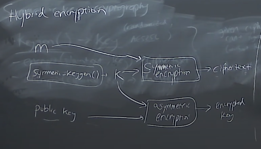
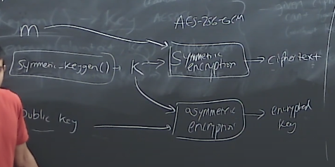

# mit-missing-semester note

## Lecture 1 Overview + The Shell

- echo Hello\ World
- echo $PATH ->
  /home/lanzeliu/.local/bin:/home/lanzeliu/bin:/usr/local/bin:/usr/bin:/usr/local/sbin:/usr/sbin
- `cd -` -> swap between the current dir and the previous one dir.
- `-rwxr-xr-x` under `/usr/bin/` those are file permissions. Sequence: owner,
  group, any other else. You can see everyone has execute permission under this
  `/usr/bin/` since it make sense not checking who that is before running `echo`
  (example).
- `drwxr-xr-x` is permission for a directory for example `/usr`. Sequence also
  owner, group, any other else. The difference is for directory: 
    - read -> list, are you allowed to see which files are under this directory.
    - write -> rename, delete, move files under this directory.
    - execute -> search, are you allowed to enter / search this directory.
- echo hello > hello.txt -> dump that string into txt file.
- cat < hello.txt -> open right side of `<`, return the content as the input to
  the left side. `hello` printed. (on the contrary of pipe `|`)
- cat < hello.txt > hello2.txt
- `>>` -> append ops.
- `/sys` contains various Kernel parameters.
- `/sys/class/backlight$`
- `#` -> root, `$` -> usr
- `tee` package -> get an input and write it into a file, also print standard
  output. `echo 1060 | sudo tee brightness`
- `find -type f -name '*brightness*'` (an example of find)
- `xdg-open <file>` -> open a file with appropriate format. (for instance
  `.html` file to open a web browser)

## Lecture 2 Shell Tools and Scripting..

- `source xyz.sh` -> automatically add bin to source for shall to execute.
- `/dev/null` -> discard message often used in output and any error messages.
- `find . -name src -type d`
- `find . -path "**/test/*.py' -type f`
- `locate README.md` -> similiar to `find`.
- ctrl + R and keep typing it for scrolling.

## Lecture 3 Editors (vim)

- normal mode and insert mode.
- `:sp` -> split a mirror terminal, `c + w` to switch screens.
- `:qa` -> quit all windows.
- `0` -> move to the beginning of the current line.
- `^` -> move to the first non-space bit of the current line.
- `$` -> move to the end of the current line.
- `c + u` -> goes up. `c + d` goes down.
- `G` -> goes the end of the file. `gg` -> goes the beginning of the file.
- `f<>` -> find the first char, for example `fo` find the first `o` in the line.
- `u` -> revert / undo. `c + r` redo.
- `5dd` -> delete 5 lines beginning from the current cursor. `dw` -> delete the
  following word.
- `y` -> copy. `p` -> paste.
- `yy` -> copy the line. `yw` -> copy the word.
- `v` -> visual mode, this mode allows many common functions like regular
  editor. For example you can use `c + arrows` to select lines.
- `4j`, `1k`, `2h`, `3l` -> move number of steps.
- `/` -> search / find. `n` -> next matched one. `N` -> previous matched one.

example `~/.vimrc` MIT gives (rc stands for run commands):
```
" Comments in Vimscript start with a `"`.

" If you open this file in Vim, it'll be syntax highlighted for you.

" Vim is based on Vi. Setting `nocompatible` switches from the default
" Vi-compatibility mode and enables useful Vim functionality. This
" configuration option turns out not to be necessary for the file named
" '~/.vimrc', because Vim automatically enters nocompatible mode if that file
" is present. But we're including it here just in case this config file is
" loaded some other way (e.g. saved as `foo`, and then Vim started with
" `vim -u foo`).
set nocompatible

" Turn on syntax highlighting.
syntax on

" Disable the default Vim startup message.
set shortmess+=I

" Show line numbers.
set number

" This enables relative line numbering mode. With both number and
" relativenumber enabled, the current line shows the true line number, while
" all other lines (above and below) are numbered relative to the current line.
" This is useful because you can tell, at a glance, what count is needed to
" jump up or down to a particular line, by {count}k to go up or {count}j to go
" down.
set relativenumber

" Always show the status line at the bottom, even if you only have one window open.
set laststatus=2

" The backspace key has slightly unintuitive behavior by default. For example,
" by default, you can't backspace before the insertion point set with 'i'.
" This configuration makes backspace behave more reasonably, in that you can
" backspace over anything.
set backspace=indent,eol,start

" By default, Vim doesn't let you hide a buffer (i.e. have a buffer that isn't
" shown in any window) that has unsaved changes. This is to prevent you from "
" forgetting about unsaved changes and then quitting e.g. via `:qa!`. We find
" hidden buffers helpful enough to disable this protection. See `:help hidden`
" for more information on this.
set hidden

" This setting makes search case-insensitive when all characters in the string
" being searched are lowercase. However, the search becomes case-sensitive if
" it contains any capital letters. This makes searching more convenient.
set ignorecase
set smartcase

" Enable searching as you type, rather than waiting till you press enter.
set incsearch

" Unbind some useless/annoying default key bindings.
nmap Q <Nop> " 'Q' in normal mode enters Ex mode. You almost never want this.

" Disable audible bell because it's annoying.
set noerrorbells visualbell t_vb=

" Enable mouse support. You should avoid relying on this too much, but it can
" sometimes be convenient.
set mouse+=a

" Try to prevent bad habits like using the arrow keys for movement. This is
" not the only possible bad habit. For example, holding down the h/j/k/l keys
" for movement, rather than using more efficient movement commands, is also a
" bad habit. The former is enforceable through a .vimrc, while we don't know
" how to prevent the latter.
" Do this in normal mode...
" nnoremap <Left>  :echoe "Use h"<CR>
" nnoremap <Right> :echoe "Use l"<CR>
" nnoremap <Up>    :echoe "Use k"<CR>
" nnoremap <Down>  :echoe "Use j"<CR>
" ...and in insert mode
" inoremap <Left>  <ESC>:echoe "Use h"<CR>
" inoremap <Right> <ESC>:echoe "Use l"<CR>
" inoremap <Up>    <ESC>:echoe "Use k"<CR>
" inoremap <Down>  <ESC>:echoe "Use j"<CR>
```

## Lecture 4 Data Wrangling

- one code style suggestion: change `ssh <remote_server> journalctl | grep ssh |
  grep "Disconnected from" | less` => `ssh <remote_server> 'journalctl | grep
  ssh | grep "Disconnected from"' | less`

  By this way, make all required ops only happens in the server, not the host.
- `sed` -> modify content of course.
- regular expression: `.` -> any characters. `*` -> 0 or any previous
  characters. `.*` -> any number of any characters.
- `[ab]` -> a or b character. So, `s/[ab]//` (aba / bba) => (ba). `s/[ab]//g` =>
  ().
- `(ab)` -> ab string.
- `s/(ab|bc)*//g` -> remove ab or bc. - one good example: `cat ssh.log | sed -E
's/^.*Disconnected from (invalid |authenticating )?user (.*) [0-9.]+ port [0-9]+
( \[preauth\])?$/\2/'`

  - `^` -> beginning of the text. `$` -> end of the text.
  - `?` -> 0 or 1.
  - `(..)` represent a group, you can see there are three groups in the example,
    note that the second group does not do any ops from sed, but for the
    replacement `\2`, it put the second group content string `(.*)` here.
- material: regular expression 101 -> https://regex101.com/
- `.*?Disconnected from ... ()` -> that `?` will make sure once it finds the
  first that pattern, it will treat the rest of content as group in this case.
- `wc -l` count the lines of an output or a file.
  - `wc` -> word count.
  - `-l` -> lines.
- `sort`
- `uniq -c` -> unique count.
- `awk` -> column based stream processor. `awk` has lots of functions and it is
  a programming language.
  - `awk '$1 ==1 && $2 ~ /^c.*e$/ {print $0}` => print the columns that second
    column matches starts with c and end with e.
- `bc` -> berkerly count. `bc -l` calculate probably two string plus, like "1+1"
  | bc -l => 2.
- `xargs`: organize output and put them as arguments.
  - example: `rustup toolchain list | grep nightly | grep -v 'nightly-x86' |
    grep 2019 | sed 's/-x86.*//' | xargs rustup toolchain uninstall` => `rustup
    toolchain uninstall <> <> <> ... <>
- `ffmpeg` -> tool converting audio / video.
- `tee` -> dump / write the output to file(s) in the meantime print the output.

## Lecture 5 Command-line Environment

- `signal` package - catch some terminal operations. Like if you have `ctr + c`
  it can catch that user ops.
- `alias <>`. Example `alias ll` => `ls -lah`.
- `alias gs=git status`, however, I think this might cause conflict, sometimes
  giving full context won't hurt the thing too much, or make things mess.
- This `alias` can also be put into `.bashrc` file to make it work.
- dotfile.
- How to generate a ssh connection:
  - `ssh-keygen` => generate key pair under `~/.ssh`: `id_rsa` & `id_rsa.pub`.
  - `sudo apt install openssh-server`
  - `sudo systemctl start sshd` => `systemctl` supported by `systemd` to enable
    the sshd server daemon.
- An example of `~/.ssh/config`:
  ```
  Host vm1
    User user1
    HostName 192.168.xxx.xxx
    IdentityFile ~/.ssh/id_rsa
    RemoteForward 9999 localhost:8888
  ```
- `tmux` -> manage multiple terminal sessions within a single window, useful? Or
  make it more complex?

## Lecture 6 Version Control (git)

- `git remote add <remote name> <remote repository URL>` -> `<remote name>`:
  This is the shorthand name you assign to the remote repository. Common names
  include `origin` for the primary or default remote, and `upstream` typically
  used for the original repository when you have forked a project.

## Lecture 7 Debugging and Profiling

- n/a on note.

## Lecture 8 Metaprogramming (build system / Makefile / make / release version)

- `%` stands for any string file name.
- `$*` -> display the stem, base name of the file without the extension.
- `$@` -> represent the target of the rule.
- `$<` -> represent the first prerequisite of the rule.
- `version` for break debugging purpose mainly. Remember major version, minor
  version, and patch / release version.
- A lock file in software development is NOT primarily for version control in
  the traditional sense, like Git. Instead, it's used in dependency management
  systems within various programming environments to control and manage the
  exact versions of packages and dependencies used in a project. This ensures
  consistency across different development environments and production, and
  helps avoid "it works on my machine" issues. Freeze the ecosystem.
- `Continuous Integration` (those bars under README Github project repo) -> like
  when you push PR there will be a PR pipeline testing run. <- achieved by event
  triggered actions.
- `cmake` -> generate make file for c project. Usually if the make file is
  large, sometimes they have a template build tool for all for general usage.
- `maven` / `ant` help to build Java env / eco.

## Lecture 9 Security and Cryptography (super interetsing!)

- bit: binary digit.
- Entropy: log2(#possibility)
  - coin flip: log2(2) -> 1 bit
  - dice roll: log2(6) bit
- `sha1sum`, `sha256sum`, `sha512sum` calculate different bytes hexadecimal
  hash.
- key derivation functions (KDFs)
  - symmetric key cryptography
    - keygen() -> key
    - func encrypt(plaintext, key) -> ciphertext (密文)
    - func decrypt(ciphertext, key) -> plaintext
    - property:
      - given ciphertext, can NOT figure out plaintext without key.
      - decrypt(encrypt(m, k), k) == m
- Instead of keep saving or remembering the key, we can just use passphrase.
  - `passphrase` => `KDF` => key
- demo:
  - `openssl aes-256-cbc -salt -in README.md -out README.enc.md` => let you
    enter key which later will be saved => `README.enc.md` will be an encrypted
    file. (salt and encrypted content are both saved in the output file.)
  - `openssl aes-256-cbc -d -in README.enc.md -out README.dec.md` => by entering
    your key, the original README file will be decrypted.
- salt:
  - rainbow table: to save hashed password with salt string, so, `hash(password
    string + salt string)`, salt can be random string, can not be encrypted, can
    be saved in the rainbow tabel as well.
  - The reason why we need it is if hackers leak the hashed password from
    rainbow table, it will not affect other social website, due to different
    servers have different unique salt string.
- Asymmetric key cryptography
  - keygen() -> (publich key, private key)
  - encrypt(plaintext, public key) -> cryptedtext
  - decrypt(c, private key) -> plaintext
  - sign:
    - sign(message, private key) -> signature
    - verify(message, signature, public key) -> OK?
    - Nobody can provide the correct signature without the private key, so in
      that case, the verification will fail.
    - hard to forge without private key.
    - correctness.
  - usages:
    - encrypted email: you can send a encrypted email with a public key bared,
      the receiver can user their private key to open and read it.
    - encrypted message from social media app: when you post a message, you can
      post your public key to the server as well, then if someone else send you
      a message, they can leverage your public key to encrypt the message, then
      send the encrypted message to you, on your local you can decrypt the
      message and read the plain message. And btw, the key pair public key and
      private key are usually generated by your hardward device itself (or I
      think certain software app can also do this?).
    - some software can be signed with asymmetric keys, to make sure certain
      software packages are being sent to the right person.
  - how to known the public key you download is the correct one from mine?
    - some social media app match the public key to phone number, but the server
      will be a potential break point, so that from the server tehy need to have
      a way to authenticate the public key is the correct one without tampering.
      Some apps just let people scan QR code face to face to get rid of this
      risk.. Of course there are some other ways to solve / mitigate this, like
      social trust.
- Why symmetric is faster than asymmetric?
  - because asym is using hybrid encryption.
  - 
  - 

## Lecture 10 potpourri

- Concepts mentioned
  - Keyboard remapping
  - Daemon processes
  - File system in user space
  - Backups
  - APIs
  - Command line arguments
  - Window managers (NOT Windows!)
    - for example in Windows, `ctr + arrows`, do not have to use mouse to move.
  - VPNs
  - Markdowns
  - Desktop automation (MacOS): similar to Window manager before, but for MacOS.
  - Booting and live USBs
  - Virtual machines, Cloud and docker
  - Notebook programming environment
  - Github

## Lecture 11 Q & A

- When do I use Python versus a Bash script?
  - It depends, the whole business logic should be in programming language
    mostly, script is for some certain needs, usually less than 100 lines of
    code.
- What is diff between `source ./certain_script.sh` and directly execute
  `./certain_script.sh`?
  - Directly Running a Script
    - When you run a script directly, you typically do so by invoking it from
      the shell as an executable or by calling it with an interpreter
      explicitly. Here are the key aspects of this approach:
    - New Process: The script runs in a new subshell (a separate process) that
      is a child of the current shell. Any changes made to the environment (like
      setting environment variables, changing directories, etc.) do not persist
      when the script completes; they are local to the subshell.
    - Permissions: The script file needs to have execute permissions in order to
      be run directly. This is typically set with chmod +x script.sh.
  - Sourcing a Script
    - Sourcing a script means executing the script in the current shell
      environment, not in a new subshell. Here’s what happens when you source a
      script:
    - Current Shell: The script is executed within the existing shell process;
      no new process is created. As a result, any changes made to the
      environment variables, current directory, or shell settings are retained
      in the current shell session after the script completes.
    - No Need for Execute Permissions: Since the script is read and executed in
      the current shell, it does not need to be marked as executable. It only
      needs to be readable.
- `/bin` usually contains essential binaries. `/lib` contains libraries the bins
  can link to. `/etc` contains configuration files. `/var` contains files change
  with time, like logs. `/opt` contains 3rd party softwares.
- When you use containers to isolate environment, you better make the underlying
  OS to be roughly the same, cuz they share the lower level OS right. Like for
  example if you have the Linux software in container trying to run on MacOS
  host that might not work the best as expected.
- 2FA, or Two-Factor Authentication, is a security process that requires two
  different forms of identification from the user to grant access to an online
  account or a system. This method significantly enhances security by adding an
  extra layer of verification beyond just the username and password combination.
  Like Ubi key.
